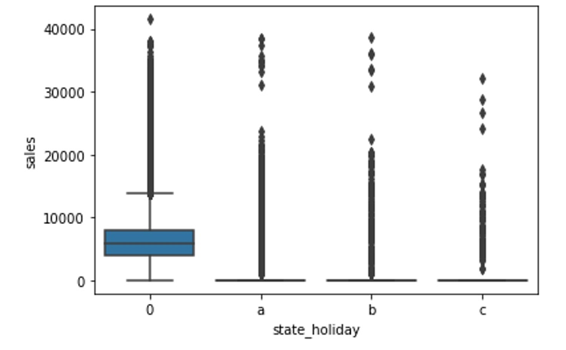

# Sales Forecast for Rossmann Stores (Time Series + Telegram Bot)

_This sales prediction project uses data from Rossmann, a Germany-based drug store chain with operations over more than 3,000 stores across seven European countries. The dataset is publicly available from a [Kaggle competition](https://www.kaggle.com/c/rossmann-store-sales/data)._

---
## 01. Brief Intro - Dirk Rossmann GmbH
A história da empresa começa em 1972, quando Dirk Roßmann abriu a primeira farmácia de autoatendimento na Alemanha. Hoje, a Dirk Rossmann GmbH, com 56.300 funcionários e 4.244 filiais, é uma das maiores redes de farmácias da Europa. Em 2020, o Grupo ROSSMANN gerou vendas de 10,35 bilhões de euros na Alemanha, Polônia, Hungria, República Tcheca, Albânia, Kosovo, Espanha e Turquia. Até hoje, Dirk Rossmann GmbH é um negócio familiar gerenciado pelo proprietário e internacionalmente ativo e é de propriedade majoritária da família Roßmann. Além disso, o Grupo A.S. Watson, globalmente ativo, tem uma participação de 40% na empresa.

---

## 02. Business Request
### a.	The Business Situation
**Cenário**: “O CFO da empresa fez uma reunião com todos os gerentes de loja e pediu que cada um deles trouxesse uma previsão diária das próximas 6 semanas de vendas.
Depois da reunião, todos os gerentes entraram em contato, requisitando uma previsão de vendas de sua loja.”
### b.	Questão de Negócio:
**Qual é o valor das vendas de cada loja nas próximas 6 semanas?**  

### c.	Entendimento do Negócio:
- **Qual é a motivação?** A previsão de vendas foi requisitada pelo CFO em uma reunião mensal sobre os resultados das lojas.  
- **Qual é a causa raiz?** Dificuldade em determinar o valor do investimento para a reforma de cada loja.
- **Quem é o dono do problema?** Diretor Financeiro ( CFO ) da Rossmann.
- **Qual o formato da entrega?**
  -	**Granularidade**: Previsão de vendas por dia para cada loja para os próximos 42 dias / 6 semanas.
  -	**Tipo do Problema**: Previsão de Vendas.
  -	**Potenciais Métodos**: Séries Temporais.
  -	**Formato da Entrega**:
  	-	O valor total de vendas de cada loja no final da sexta semana.
    - Poder verificar as informações pelo celular.

---

## 03. Data Preparation
### a.	O Objetivo da Descrição dos Dados
**“O quão desafiador é o problema que estou lidando”**. Precisamos saber a dimensão do problema que iremos enfrentar. Pode ser um problema que dure anos ou pode ser um problema que dure semanas.

### b.	Qual a Quantidade de Dados?
**Servidores? Clusters? Spark? Hadoop?**
Eu tenho os recursos corretos para trabalhar?
Dependendo da quantidade de dados, o nosso computador pessoal não vai suportar e necessitaremos de servidores, cluster de servidores, linguagens preparadas para trabalhar com uma grande quantidade de dados, como por exemplo Spark e Hadoop.

### c.	Tipos de Variáveis
**Quais são os tipos de variáveis? (% Numérica, % Categórica, % Temporal)**. Saber a porcentagem do tipo dos dados vai nos guiar à escolher as técnicas para trabalhar com os tipos de variáveis.

### d.	Quantidade de Dados Faltantes
-	**Qual o volume de dados NA?**
  Necessitamos saber qual o volume de dados NA (não aplicável) ou vazio no conjunto de dados.
  Dependendo da quantidade de dados NA, podemos tomar duas decisões?
  
    -	Não fazer o projeto porque não temos dados suficiente.
    	
    -	Continuar com o projeto:
        -	Descartar as linhas que possuírem dados vazios.
  	         -	**Vantagem**: é rápido.
  	         -	**Desvantagem**: estamos jogando dado fora. As vezes descartas linhas não é uma boa estratégia, principalmente se temos poucos dados. As vezes apenas uma variável está NA, mas todas as outras variáveis estão completas e estas informações são muito importantes para o algoritmo aprender os padrões. Então, descartar as linhas pode prejudicar a performance do modelo.
        -	Preencher os dados vazios.
            -	Quando não temos informação de negócio: utilizando algoritmos de machine learning, utilizando mediana, media, etc...
            -	Entender o negócio: As vezes o NA está lá porque é uma lógica de negócio, foi definida por uma regra de negócio e soubermos a regra, podemos colocar valores nos NA´s e recuperar os dados.

### e. Resumo Geral dos Dados
A **Estatística Descritiva** nos fornece uma noção da grandeza dos dados, ter uma noção de limites mínimos e máximos das variáveis, mediana, estatísticas básicas para poder descrever os dados de uma maneira macro.

### f. Data Dimension
**Dados de treino**:
- Number of rows: 1017209
- Number of columns: 18

### g. Data Type
| Variable      | Data Type |
| ----------- | ----------- | 
|store|int64|
day_of_week|                       int64
date|                             object
sales|                             int64
customers|                         int64
open|                              int64
promo|                             int64
state_holiday|                    object
school_holiday|                    int64
store_type|                       object
assortment|                       object
competition_distance|            float64
competition_open_since_month|    float64
competition_open_since_year|     float64
promo2|                            int64
promo2_since_week|               float64
promo2_since_year|               float64
promo_interval|                   object

### h. Check NA
| Variable      | Qty |
| ----------- | ----------- | 
store|                                0
day_of_week|                          0
date|                                 0
sales|                                0
customers|                            0
open|                                 0
promo|                                0
state_holiday|                        0
school_holiday|                       0
store_type|                           0
assortment|                           0
competition_distance|              2642
competition_open_since_month|    323348
competition_open_since_year|     323348
promo2|                               0
promo2_since_week|               508031
promo2_since_year|               508031
promo_interval|                  508031

### i.	Fillout NA
-	**i. Competition Distance**: No site do Kagle [Rossmann Store Sales](https://www.kaggle.com/c/rossmann-store-sales/data) temos a seguinte definição para esta variável: _distance in meter to the nearest competitor store_.
Verifiquei que a distância em metros do competidor mais distante era de 75860. Eu assumi o valor **200000** para os valores faltantes.

-	**ii. Competition_open_since_month**: No site do Kagle [Rossmann Store Sales](https://www.kaggle.com/c/rossmann-store-sales/data) temos a seguinte definição para esta variável: _gives the approximate year and month of the time the nearest competitor was opened_. O valor pode estar vazio porque não possui competidor, ou porque não sabemos a data de abertura do concorrente. Pode ter sido aberta antes da inauguração da nossa loja ou abriu depois mas alguém esqueceu de anotar.
Eu assumi como premissa para os dados faltantes, o valor do mês da variável `date`.
Mantive este valor na variável, pois um competidor influencia no volume de vendas. Quando um competidor abre recentemente, o volume de vendas na nossa loja cai. Com o tempo, as vendas na nossa loja aumentam, porém não vão retornar ao patamar antes da inauguração do competidor.
Assumir o valor do mês do campo `date` pode não ter lógica, pois temos a influência do campo competition_distance.
Não era certeza que esta premissa iria funcionar. Por isso utilizei o método cíclico de gerenciamento de projeto chamado CRISP-DM (Cross Industry Standard Process for Data Mining). Na primeira iteração do CRISP-DM, utilizei esta premissa. Se o algoritmo não performasse bem, no próximo ciclo do CRISP-DM, poderia alterar esta premissa para esta feature.

-	**iii. Competition_open_since_year**: No site do Kagle [Rossmann Store Sales](https://www.kaggle.com/c/rossmann-store-sales/data) temos a seguinte definição para esta variável: _gives the approximate year and month of the time the nearest competitor was opened_. Eu assumi como premissa para os dados faltantes, o valor do ano da variável `date`. Foi utilizado o mesmo raciocínio descrito acima para a variável `Competition_open_since_month`.

-	**iv. promo2_since_week**: No site do Kagle [Rossmann Store Sales](https://www.kaggle.com/c/rossmann-store-sales/data) temos a seguinte definição para esta variável: _describes the year and calendar week when the store started participating in Promo2_. Eu substituí os valores faltantes pelo valor da semana da variável `date`.

-	**v. promo2_since_year**: No site do Kagle [Rossmann Store Sales](https://www.kaggle.com/c/rossmann-store-sales/data) temos a seguinte definição para esta variável: _describes the year and calendar week when the store started participating in Promo2_. Eu substituí os valores faltantes pelo valor do ano da variável `date`.

-	**vi. promo_interval**: No site do Kagle [Rossmann Store Sales](https://www.kaggle.com/c/rossmann-store-sales/data) temos a seguinte definição para esta variável: _describes the consecutive intervals Promo2 is started, naming the months the promotion is started anew. E.g. "Feb,May,Aug,Nov" means each round starts in February, May, August, November of any given year for that store_. Eu substituí os valores faltantes pelo valor 0.
    -	Foi criada a variável `month_map` com o valor do mês da variável `date`.
    - Foi criada a variável `is_promo` onde foram utilizadas as seguintes condições:
        - se o valor da variável `promo_interval` for igual à 0, atribui o valor 0 na variável `is_promo`, significando que a loja não está participando da promoção.
        - se o valor da variável `promo_interval` for diferente de 0, atribui o valor 1 na variável `is_promo`, se algum dos meses contidos no valor da variável `promo_interval` for igual ao valor do mês da variável `month_map`. Caso contrário, é atribuído o valor 0 na variável `is_promo`.

### j.	Change Type
-	Foram alterados os tipos das features `competition_open_since_month`, `competition_open_since_year` , `promo2_since_year` e `promo2_since_week` de float64 para int64.
-	Foi alterado o tipo da feature `date` de object para datetime64.

### k. Descriptive Statistics
-	**i. Numerical Attributes** 

`competition_distance` and `competition_open_since_year` are heavily skewed;

`customers`, `competition_distance`, `competition_open_since_year` have a high kurtosis, which indicates a profusion of outliers;
 
 
-	**ii. Categorical Attributes**

O gráfico acima exibe uma distribuição muito dispersa dos dados, pois a dimensão das variáveis está muito diferente.
Isto é muito provável de ocorrer, pois temos dias que são feriados, onde a loja está fechada e consequentemente a quantidade de vendas é zero.
Neste caso, a coluna 0 que representa dias sem feriados possui um volume de vendas bem maior que as outras três colunas a, b e c que são feriados: a = public holiday, b = Easter holiday, c = Christmas.
Desta maneira, criei dois boxplots separados, um para os dias normais e outro para os feriados.

O gráfico acima representa os dias que são feriados onde a loja estava aberta, isto é, com o valor da variável `sales` diferente de zero.

O gráfico acima representa os dias que não são feriados onde a loja estava aberta, isto é, com o valor da variável `sales` diferente de zero.
-	`state_holiday`, `store_type`, `assortment` have many outliers.

---

## 04. Feature Engineering
### a. O Mapa Mental de Hipóteses
A Análise Exploratória de Dados é um passo que pode ser tão complicado e tão detalhado quanto você queira.
A causa disso é que existem várias maneiras de fazer uma análise exploratória de dados e existem vários detalhamentos que podemos executar.

Podemos gastar muito tempo neste passo e temos que lembrar que estamos trabalhando em Ciclos de desenvolvimento e consequentemente, iremos executar novamente este passo. Então, não precisamos perder muito tempo neste passo, pois iremos detalhá-lo cada vez que executarmos um novo ciclo.

Para sabermos qual o mínimo de detalhamento que necessitamos ter, é necessário realizar um Mapa Mental de Hipóteses que é basicamente um roteiro que vai nos mostrar quais variáveis precisamos ter para fazer determinadas análises e validar as hipóteses.

O Mapa Mental de Hipóteses vai nos guiar na Análise Exploratória de Dados, possibilitando realizar este passo de forma muito mais rápida, mais direta e trazer Insights valiosos para aquele momento do ciclo do CRISP-DM.

-	**i. Fenômeno:**
Qual o fenômeno que estou modelando?
Aquilo que estou tentando medir ou modelar. Por exemplo: vendas, detecção de objetos em uma imagem, classificação da imagem entre gato e cachorro, Clusterização de clientes para criação de Personas, etc...
É o fenômeno que estamos modelando para ensinar os algoritmos de Machine Learning.

-	**ii. Agentes:**
Quem são os agentes que atuam sobre o fenômeno de interesse?
São todas as entidades que de alguma forma impactam no fenômeno.
Por exemplo: Você acha que os clientes impactam no fenômeno de vendas? A resposta é sim, pois se tivermos mais clientes, provavelmente teremos mais vendas. Lojas também são agentes, pois quanto mais lojas temos, mais iremos vender. Produto também é um agente, pois produto tem um preço que se subirmos o preço do produto venderemos menos e se diminuirmos venderemos mais.

-	**iii. Atributos do Agente:**
Qual é a descrição dos agentes?
Por exemplo: O cliente possui uma idade, escolaridade, estado civil, família, número de filhos, frequência que vai na loja, salário, profissão, etc ...

-	**iv. Lista de Hipóteses**.
O objetivo do Mapa Mental de Hipóteses é derivar uma lista de hipóteses e com esta lista iremos priorizar e fazer a análise para validar estas hipóteses.
Cada hipótese validada ou descartada é um Insight.
Um Insight é gerado através de duas formas:  
    -	**Através da surpresa**: Exemplo: Descobrimos que vendemos mais aos Sábados e ninguém sabia desta informação.
    -	**Contrapor uma crença**: Exemplo: o CFO diz ter certeza que acontecem mais vendas no final do ano. Durante a exploração dos dados é verificado que se vende menos no final do ano e isto choca a crença do CFO que esperava outra informação e ele gosta deste Insight que realizamos.
        
       Todas as informações que recebemos dos times de negócio que podem influenciar nas vendas, iremos utilizá-las para criar o Mapa Mental de Hipóteses e as suas respectivas afirmações de Hipóteses. Iremos anotar todos os agentes e perguntar para as pessoas quais são os atributos de cada agente.
       Hipóteses são APOSTAS. É o que você acha sobre alguma coisa:
    -	Lojas de MAIOR Porte deveriam Vender MAIS.
    -	Lojas com MAIOR Sortimento deveriam Vender MAIS.
    -	Lojas com MAIS Competidores deveriam Vender MENOS.
    
       É importante deixar claro dois pontos para as pessoas envolvidas:
    -	**Primeiro**: Deixar claro que estas informações de Hipótese são apostas, portanto iremos precisar primeiro dos dados para validar se uma Hipótese é correta ou não.
    -	**Segundo**: A Hipótese não é uma relação de causa e efeito, é apenas uma correlação. Não podemos afirmar que lojas de maior porte deveriam vender mais e então, aumentamos o tamanho de todas as lojas. Isto não é verdade porque o fenômeno de vendas, sofre o impacto de todas as outras entidades ao mesmo tempo. Utilizamos cada atributo do nosso conjunto de dados e relacionamos eles com a nossa variável resposta que no nosso caso são as vendas.

       Não podemos afirmar que lojas de maior porte deveriam vender mais e então, aumentamos o tamanho de todas as lojas. Isto não é verdade porque o fenômeno de vendas, sofre o impacto de todas as outras entidades ao mesmo tempo.
       Utilizamos cada atributo do nosso conjunto de dados e relacionamos eles com a nossa variável resposta que no nosso caso são as vendas.
       Estamos procurando com as hipóteses saber todos os pequenos efeitos que contribuem para aumentar ou diminuir a venda e desta maneira, poder ensinar o algoritmo de Machine Learning à aprender estes padrões.

    -	**Hipóteses das Lojas**
    1. Lojas com número maior de funcionários deveriam vender mais.
    2. Lojas com maior capacidade de estoque deveriam vender mais.
    3. Lojas com maior porte deveriam vender mais.
    4. Lojas com maior sortimento deveriam vender mais.
    5. Lojas com competidores mais próximos deveriam vender menos.
    6. Lojas com competidores à mais tempo deveriam vender mais.

    -	**Hipóteses dos Produtos**
    1. Lojas que investem mais em Marketing deveriam vender mais.
    2. Lojas com maior exposição de produto deveriam vender mais.
    3. Lojas com produtos com preço menor deveriam vender mais.
    4. Lojas com promoções mais agressivas (descontos maiores), deveriam vender mais.
    5. Lojas com promoções ativas por mais tempo deveriam vender mais.
    6. Lojas com mais dias de promoção deveriam vender mais.
    7. Lojas com mais promoções consecutivas deveriam vender mais.

    -	**Hipóteses de Tempo** :
    1. Lojas abertas durante o feriado de Natal deveriam vender mais.
    2. Lojas deveriam vender mais ao longo dos anos.
    3. Lojas deveriam vender mais no segundo semestre do ano.
    4. Lojas deveriam vender mais depois do dia 10 de cada mês.
    5. Lojas deveriam vender menos aos finais de semana.
    6. Lojas deveriam vender menos durante os feriados escolares.

